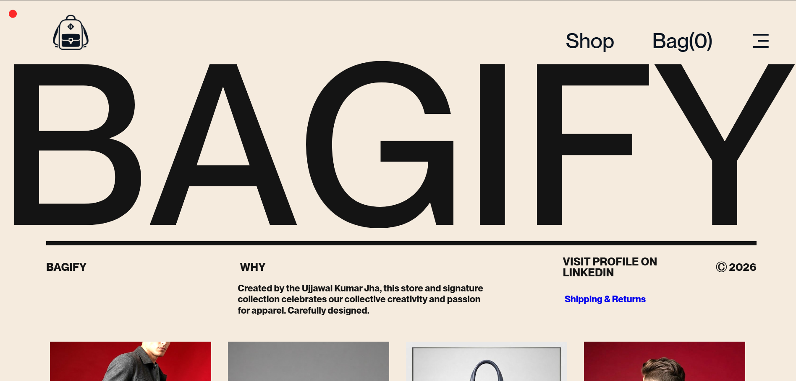
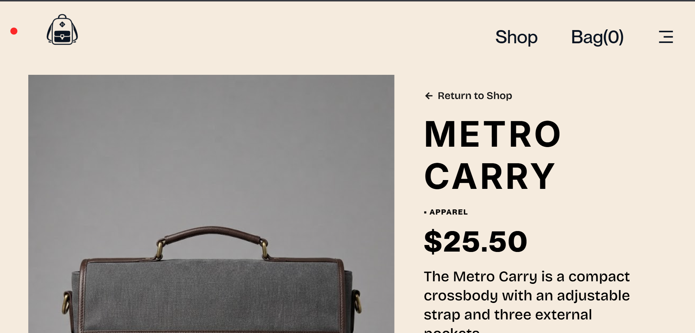
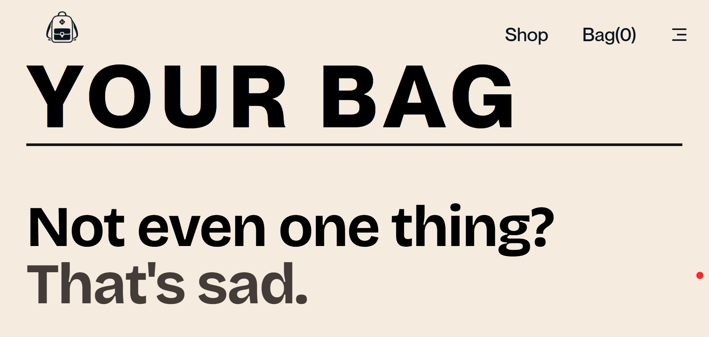

<div align="center">

# BAGIFY

A premium animated shopping experience built with React, GSAP and Vite.

### Live Demo

https://ujjawal442025.github.io/Bagify/

</div>

---

# Preview

> Add screenshots below.







---

# About

Bagify is a modern premium shopping website inspired by high-end fashion brands.

The project focuses on creating an immersive browsing experience using smooth page transitions, cinematic preloaders and advanced GSAP animations instead of traditional ecommerce layouts.

Although the products are static, the UI behaves like a premium commercial website.

---

# Features

- Premium GSAP Preloader
- Custom Page Transition Animation
- SplitText Hero Animation
- Smooth Product Reveal Animation
- Custom Cursor
- Product Detail Pages
- Shopping Bag System
- Responsive Layout
- React Router Navigation
- GitHub Pages Deployment

---

# Built With

- React
- Vite
- GSAP
- React Router DOM
- CSS3

---

# Folder Structure

```
src/

components/
assets/
App.jsx
main.jsx
index.css
```

---

# Installation

Clone the repository

```bash
git clone https://github.com/Ujjawal442025/Bagify.git
```

Go inside

```bash
cd Bagify
```

Install dependencies

```bash
npm install
```

Run locally

```bash
npm run dev
```

Build

```bash
npm run build
```

Deploy

```bash
npm run deploy
```

---

# What I Learned

While building Bagify I practiced

- Advanced GSAP timelines
- SplitText animations
- React component architecture
- React Router
- Custom page transitions
- Deployment using GitHub Pages
- Performance optimization
- Asset management in Vite

---

# Future Improvements

- Checkout Page
- Payment Gateway
- Backend Integration
- User Authentication
- Wishlist
- Product Filtering
- Search
- Dark Mode

---

# Author

## Ujjawal Kumar Jha

Frontend Developer

GitHub

https://github.com/Ujjawal442025

LinkedIn

(Add your LinkedIn profile)
https://www.linkedin.com/in/ujjawal-kumar-jha-03110b371/

---

# License

This project is for learning and portfolio purposes.
